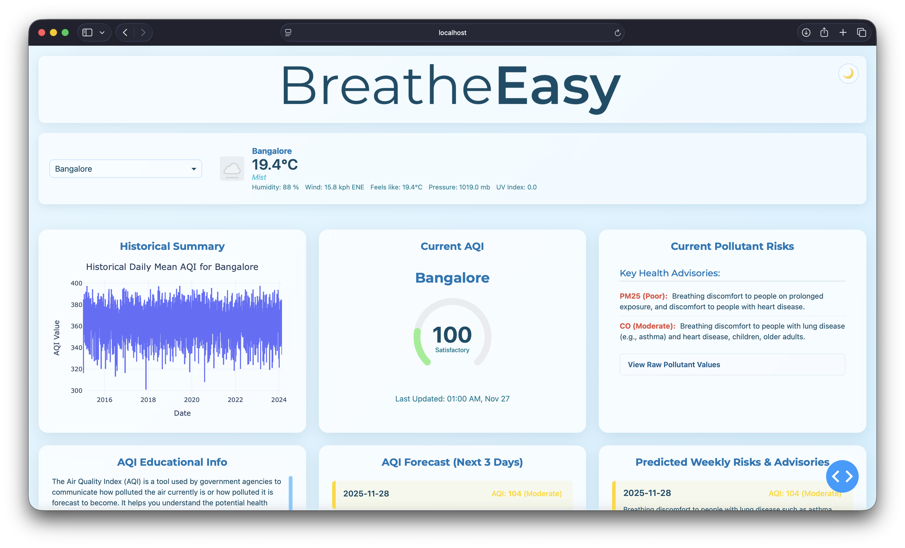
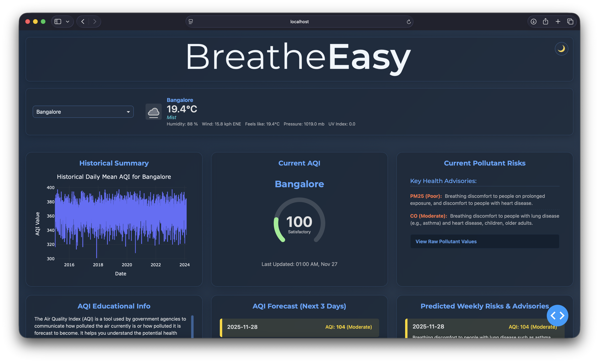

<div align="center">
  
  
</div>

# BreatheEasy: Live AQI Analysis & Forecasting Dashboard

*A multi-page, real-time Air Quality Index monitoring dashboard with a self-correcting forecast model and a live performance hub, built with Python and Dash.*

---

## Overview

BreatheEasy is a full-stack air quality analysis and forecasting dashboard. It provides a clean, intuitive web interface for major Indian cities to:
-   Analyze historical Air Quality Index (AQI) trends.
-   Display real-time AQI and weather information.
-   Generate an intelligent, 3-day AQI forecast that self-corrects based on live data.
-   Translate complex air quality data into clear, understandable health risks based on the official CPCB (Central Pollution Control Board) standard.
-   Monitor the application's own system health via a live performance hub.

This repository contains the complete source code for the project, including a **Dash-based multi-page frontend** and a robust **Python backend** for data processing, API integration, and machine learning.

## Dashboard Preview

The application features a fully responsive, dual-theme interface that adapts to your system preferences.

| Light Theme | Dark Theme |
| :---: | :---: |
|  |  |

## Core Features

*   **Interactive Main Dashboard:** A user-friendly interface to view current AQI, pollutant risks, historical trends, and educational information. Features a seamless dual-theme (light/dark) experience.
*   **Intelligent 3-Day Forecast:** A sophisticated "Anchor and Trend" forecasting model that uses a raw LightGBM prediction and calibrates it against live AQI data for improved accuracy. The smoothing factor is dynamic, trusting the model more when its predictions are accurate and less when they are not.
*   **Live Performance Hub:** A real-time monitoring page (`/performance`) that displays live system metrics (CPU, Memory, Network I/O) via time-series graphs, tracks application process details, and provides a view of the live application logs.
*   **Persistent Background Data Collection:** A background process collects system metrics continuously from the moment the app starts, ensuring a complete history is available whenever the performance hub is viewed.
*   **Dynamic UI Components:** The dashboard features custom-built SVG gauges and responsive layouts that adapt to different screen sizes.


## How It Works

The application is architected with a clear separation between the backend data processes and the frontend presentation layers.

1.  **Model Training (Offline):**
    *   The `src/modeling/train.py` script trains a `LightGBM` model for each city on the `Master_Daily_Features.csv` dataset.
    *   The trained models are saved as `.pkl` files in the `/models` directory, along with their validation scores and feature importances.

2.  **Application Startup (Backend):**
    *   When `python app.py` is run, the main Dash application starts.
    *   A hidden `dcc.Interval` in `app.py` immediately begins a background task, continuously collecting system metrics (CPU, RAM, Network) and storing them in a central `shared_data.py` file.

3.  **User Interaction (Frontend):**
    *   A user navigates to the main dashboard (`/`). Selecting a city triggers callbacks in `pages/dashboard.py`.
    *   **Forecasting:** The `predictor.py` module is called. It loads the pre-trained LightGBM model, fetches a weather forecast, generates a raw AQI prediction, and then applies the "Anchor and Trend" logic by comparing it to a live AQI value.
    *   **Real-time Data:** The application fetches current AQI, pollutant levels, and weather from external APIs.
    *   The UI is dynamically updated with the forecast, gauges, and health advisories.

4.  **Performance Monitoring:**
    *   A user navigates to the performance hub (`/performance`).
    *   Callbacks in `pages/performance.py` read from the continuously updated data stores in `shared_data.py` to render the live graphs and scorecards, providing a real-time view of the application's health.
---

## Technology Stack

### Frontend
*   **Framework:** [Dash](https://dash.plotly.com/), Plotly
*   **UI Components:** Dash Core Components, Dash HTML Components, Dash Bootstrap Components
*   **Custom Visualization:** `dash-svg` for the dynamic AQI gauge.
*   **Styling:** Custom CSS for a dual-theme (light/dark) responsive layout.

### Backend & Data Science
*   **Language:** Python 3.10+
*   **Machine Learning:** [LightGBM](https://lightgbm.readthedocs.io/en/latest/), Scikit-learn
*   **Data Manipulation:** Pandas, NumPy
*   **System Monitoring:** `psutil`
*   **API Interaction:** `requests`

### Development & Tooling
*   **Configuration:** `PyYAML` for `config.yaml`, `python-dotenv` for API keys.
*   **Testing:** `pytest`
*   **Environment:** Jupyter Notebooks for initial data exploration.

## Project Structure

The repository is organized into a modular structure that separates concerns, making it clean and maintainable.

```
├── app.py                      # Main Dash app entry point handles background tasks
├── shared_data.py              # Central data store for performance hub
├── requirements.txt            # Python package dependencies
├── config/
│   └── config.yaml             # Central configuration for the application
├── assets/                     # CSS, images, logos, and favicon
│   ├── performance_style.css   # Stylesheet for the performance hub
│   └── style.css               # Stylesheet for the main dashboard
├── data/                       # Datasets used for training and analysis
│   └── Master_Daily_Features.csv
│  
├── models/                     # Trained LightGBM models and performance artifacts
│   ├── Bangalore_lgbm_daily_model.pkl
│   ├── Chennai_lgbm_daily_model.pkl
│   ├── Kolkata_lgbm_daily_model.pkl
│   ├── Mumbai_lgbm_daily_model.pkl
│   └── ... (and feature_importance/validation_score files)
├── pages/                      # Multi-page app layouts and callbacks
│   ├── dashboard.py
│   └── performance.py
├── src/                        # Core backend source code
│   ├── analysis/               # Historical data analysis functions
│   ├── api_integration/        # External API clients
│   ├── health_rules/           # AQI scales and interpretation logic
│   └── modeling/
│       ├── predictor.py        # Generates final, calibrated forecasts
│       └── train.py            # Trains the LightGBM models
├── notebook/                   # Jupyter notebooks for exploration and development
├── scripts/                    # Helper scripts for data processing tasks
└── 
```

## Setup and Usage

Follow these steps to set up and run the BreatheEasy dashboard on your local machine.

### 1. Prerequisites
- Python 3.10 or newer.
- `git` installed on your system.

### 2. Clone the Repository
```bash
git clone https://github.com/cp099/BreatheEasy
cd BreatheEasy
```

### 3. Set Up a Virtual Environment
It is strongly recommended to use a virtual environment to manage project dependencies.

```bash
# On macOS/Linux
python3 -m venv venv
source venv/bin/activate

# On Windows
python -m venv venv
.\venv\Scripts\activate
```

### 4. Install Dependencies
Install all required Python packages from the `requirements.txt` file.

```bash
pip install -r requirements.txt
```

### 5. Configure API Keys
The application requires API keys from two services to fetch live, real-time data.

1.  **Create the `.env` file:** In the root directory of the project, create a new file named `.env`.
2.  **Get API Keys:**
    *   **WeatherAPI:** Sign up for a free key at [weatherapi.com](https://www.weatherapi.com/)
    *   **AQICN:** Get a free token from the [World Air Quality Index Project](https://aqicn.org/data-platform/token/).
3.  **Add Keys to `.env`:** Open the `.env` file and add your keys in the following format:
    ```
    WEATHERAPI_API_KEY="YOUR_ACTUAL_WEATHERAPI_KEY_HERE"
    AQICN_API_TOKEN="YOUR_ACTUAL_AQICN_TOKEN_HERE"
    ```
> **Security Note:** The `.gitignore` file is already configured to prevent your `.env` file from being committed to Git.

### 6. Run the Application
With the setup complete, you can now run the Dash application directly.

```bash
python app.py
```
The application will start, and you can access the dashboard by navigating to the following URLs in your web browser:

*   **Main Dashboard:** `http://127.0.0.1:8050/`
*   **Performance Hub:** `http://127.0.0.1:8050/performance`

---

## (Optional) Retraining the Models

If you wish to retrain the models with new data:

1.  **Prepare Data:** Ensure your `data/Post-Processing/CSV_Files/Master_Daily_Features.csv` is up to date.
2.  **Run Training Script:** Execute the training script from the project's root directory. This will overwrite the existing model files in the `/models` directory.
    ```bash
    python src/modeling/train.py
    ```

## Contributing

Contributions to the BreatheEasy project are welcome! If you have suggestions for improvements or find any issues, please feel free to:

1.  **Open an Issue:** Describe the bug or feature proposal in detail.
2.  **Fork the Repository:** Create your own copy of the project on GitHub.
3.  **Create a Feature Branch:** (`git checkout -b feature/AmazingFeature`)
4.  **Commit Your Changes:** (`git commit -m 'Add some AmazingFeature'`)
5.  **Push to the Branch:** (`git push origin feature/AmazingFeature`)
6.  **Open a Pull Request:** Create a PR back to the main repository with a clear description of your changes.

## License

This project is distributed under the Apache License, Version 2.0. See the `LICENSE` and `NOTICE` files for more information.
